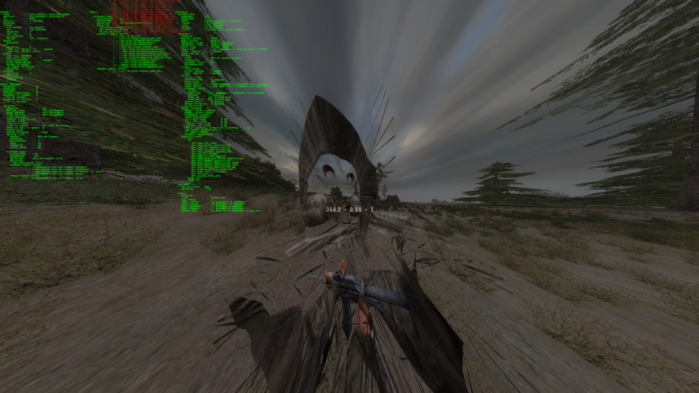
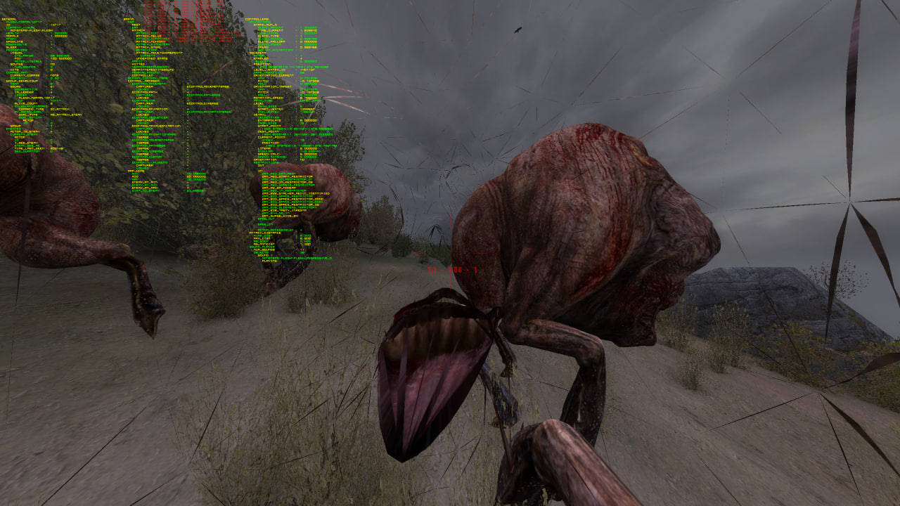

# 🌑 AI and logics

todo;  
todo;  
todo;  

## 🌓 Capturing NPC in game

To capture NPC following steps should be applied:

- Run game in `mixed` or `debug` mode (use mixed engine)
- Hold left `alt` and click on NPC

As result, you will see game world from perspective of captured NPC.  

### Using `ai_dbg_stalker on` starts rendering object details for stalkers.

### Using `ai_dbg_monster on` starts rendering object details for stalkers.

## 🌑 GOAP displaying in logs

todo;  
todo;  
todo;  

## 🌓 Getting action planners states

todo;  
todo;  
todo;  

## 🌑 AI debug console commands:

[List of commands](../game_engine/console_commands.md#-ai-debug-console-commands).

todo;  
todo;  
todo;  
