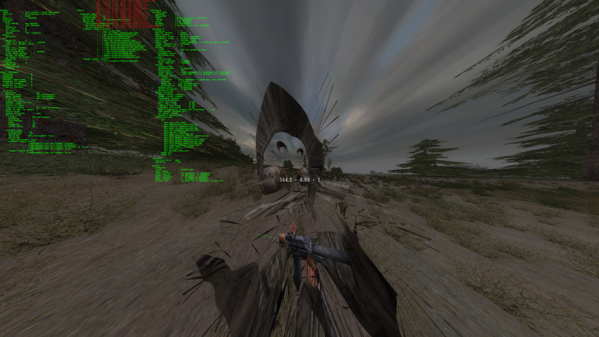
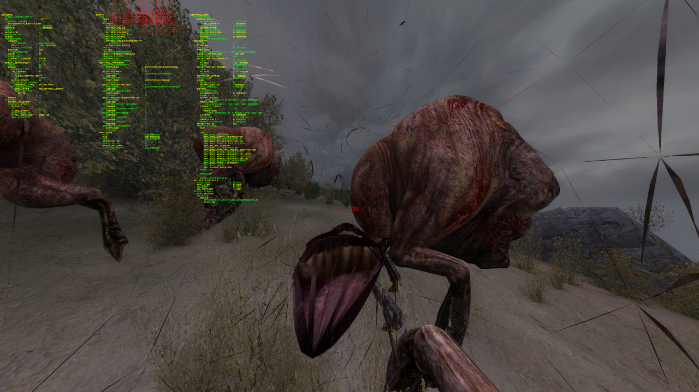
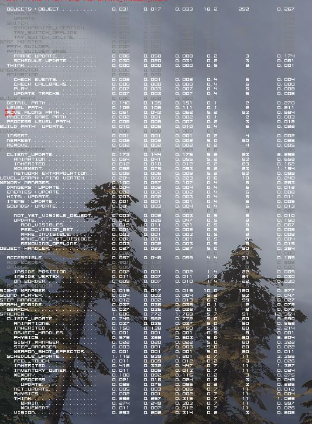

# AI and Logics

Use this page when an NPC is alive in game but its scheme, planner, relation, or animation state does not match what you
expect.

Start with the in-game overlays when you need visual context. Switch to log dumps when you need the exact script state
or GOAP action IDs.

## Capturing an NPC

NPC capture is an engine debug feature. It is useful when you need to inspect the world from the NPC perspective.

1. Run the game with a mixed or debug engine build.
2. Hold left `Alt`.
3. Click the NPC.

The camera switches to the captured object. Release the capture before continuing normal gameplay testing.

## AI Overlays

Enable stalker and monster overlays from the console:

```text
ai_dbg_stalker on
ai_dbg_monster on
```

`ai_dbg_stalker on` renders debug details for stalker objects:



`ai_dbg_monster on` renders debug details for monster objects:



Use the matching `off` command to hide each overlay.

## Planner and Scheme Logs

The XRF debug panel can print the selected object's script state to the log. Open the main menu, press `F11`, switch to
the `object` section, then choose one of the log buttons.

The object section can print:

- the active scheme, active section, logic section, smart terrain, enemy, portable store, and scheme-specific state;
- the engine action planner and the XRF state planner action IDs;
- the state manager target state, current animation state, animstate, look target, combat flag, and ALife flag;
- inventory contents, best weapon, best item, and relation data.

Planner `show(...)` output is only available when the engine exposes it. If the log says to run in mixed or debug mode,
restart with a debug-capable engine build and repeat the dump.

## Performance Stats

Use engine stats when you need frame-level AI cost, not a script-level dump:

```text
rs_stats on
ai_stats on
```

The AI stats overlay shows rows in this shape:

```text
[name][min_time][avg_time][max_time][call_rate][call_count][total_time]
```



For Lua call profiling, use the XRF debug panel `general` section. It can start or stop the `ProfilingManager`, print
hooked call counts, print manually marked profiling portions, show Lua memory use, and force Lua garbage collection.

Run Lua profiling with `-nojit` when you need cleaner call stats. The profiler logs a warning when LuaJIT is enabled
because JIT compilation can change the measured call pattern.

## Useful Console Commands

Common AI debug toggles are listed in the game engine command reference:

[AI debug console commands](../game_engine/console_commands.md#ai-debug-console-commands)
