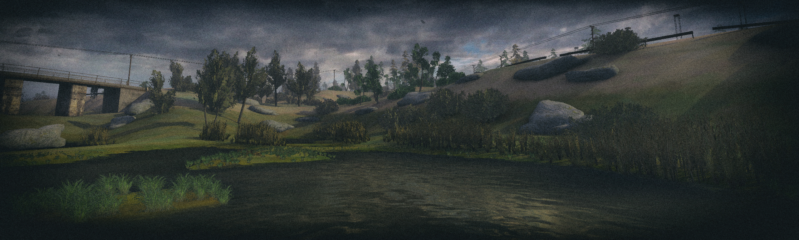

# 🎮 [Stalker XRF book](/)

Documentation for x-ray forge script engine and tools.

## 📦 Links

- Types repository: [https://github.com/xray-forge/xray-16-types](https://github.com/xray-forge/xray-16-types)
- XRF engine repository: [https://github.com/xray-forge/stalker-xrf-template](https://github.com/xray-forge/stalker-xrf-template)
- Binaries repository: [https://github.com/xray-forge/stalker-xrf-bin](https://github.com/xray-forge/stalker-xrf-bin)
- Docs repository: [https://github.com/xray-forge/stalker-xrf-book](https://github.com/xray-forge/stalker-xrf-book)

## 📦 References

- Using [rust md-book](https://github.com/rust-lang/mdBook) for documentation generation
- Using [openxray](https://github.com/OpenXRay/xray-16) as main engine
