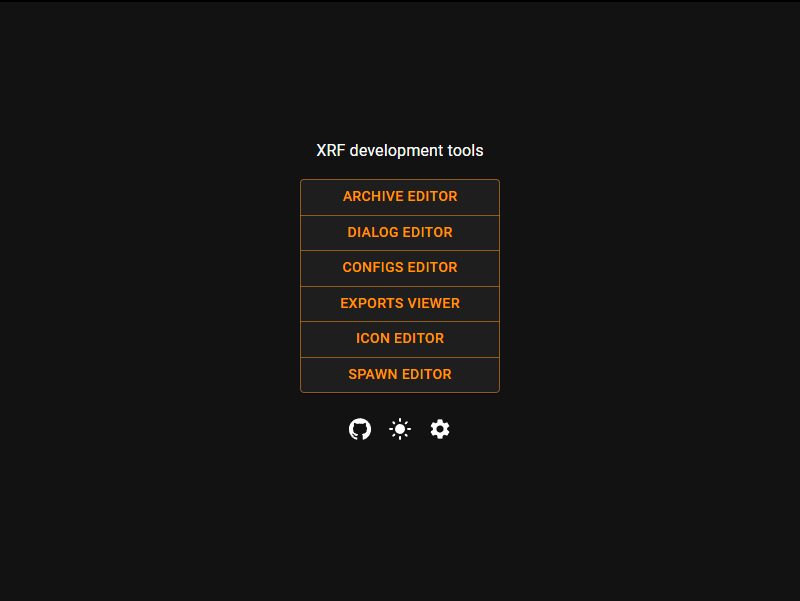

# Tools Application

The XRF tools application is a Tauri desktop app backed by Rust commands and a React UI. It groups manual inspection and
editing tools that are useful while working with X-Ray game data.

## Available Tools

- [Archive editor](archive_editor.md): browse and unpack game archives.
- [Dialog editor](dialog_editor.md): inspect and prototype dialog graph editing.
- [Config editor](config_editor.md): explore, verify, and format LTX configs.
- [Exports viewer](exports_viewer.md): inspect exported script effects, conditions, and declarations.
- [Icon editor](icon_editor.md): work with equipment sprites and icon texture descriptions.
- [Spawn editor](spawn_editor.md): inspect, import/export, pack, and unpack spawn data.
- [Translation editor](translation_editor.md): open and read translation projects.

## Development

The application source is split between:

- `bin/xrf-app` for Tauri backend commands;
- `bin/xrf-ui` for the React frontend.

For local development, the tools repository provides cargo-make tasks for backend, UI, and release builds.
