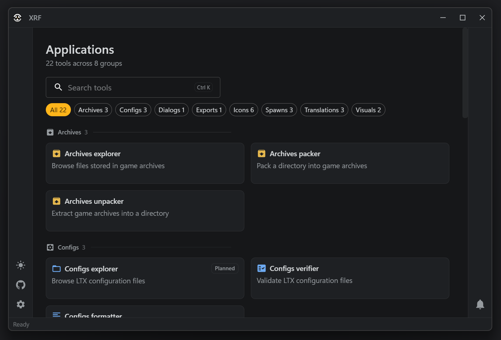

# Tools Application

The XRF tools application is a Tauri desktop app with Rust commands and a React UI. Use it for interactive inspection
and one-off data operations; use the CLI for scripted work.

The application source is split across:

- `stalker-xrf-tools/bin/xrf-app`: Tauri backend plugins and commands;
- `stalker-xrf-tools/bin/xrf-ui`: React routes, pages, stores, and components;
- `stalker-xrf-tools/crates/*`: reusable parsers, verifiers, packers, and project readers.

## Tools

| Tool                                        | Use it for                                                      | Writes files                                    |
| ------------------------------------------- | --------------------------------------------------------------- | ----------------------------------------------- |
| [Archive editor](archive_editor.md)         | Browse `.db` archive projects, read files, and unpack archives. | Unpack workflow writes files.                   |
| [Config editor](config_editor.md)           | Verify and format LTX config projects.                          | Formatter can write files.                      |
| [Dialog editor](dialog_editor.md)           | Inspect the current dialog graph prototype.                     | No production data workflow is wired.           |
| [Exports viewer](exports_viewer.md)         | Browse parsed condition, dialog, and effect declarations.       | No                                              |
| [Icon editor](icon_editor.md)               | Open equipment sprites and pack equipment icons.                | Pack workflow writes DDS output.                |
| [Spawn editor](spawn_editor.md)             | Inspect, import/export, save, pack, and unpack spawn data.      | Save/export/pack/unpack workflows write files.  |
| [Translation editor](translation_editor.md) | Open and inspect translation JSON projects.                     | No write workflow is exposed in the current UI. |

## Project paths

The app stores selected XRF project and configs paths in local storage. Several tools use those paths to prefill common
locations such as `src/engine/configs`, `target/gamedata/spawns/all.spawn`, `target/game_link`, and
`src/engine/translations`.

## Choose the CLI when

Use [Tools CLI](../cli/cli.md) when the task must be repeatable, scripted, or run in CI.
