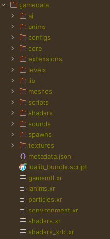

# 🥑 Building

Building is process of compiling all the XRF project code and assets into x-ray engine format. <br/>
It uses set of ordered sets to transform different parts of engine in a right way.

## Command

- `npm run cli build`
- `npx xrf build`

## Options

- `-i, --include <targets...>` - include build targets (default: include all targets)
- `-e, --exclude <targets...>` - exclude build target
- `-v, --verbose` - print verbose build logs
- `-l, --language <language>` - language to use when building mod
- `-f, --filter <targets...>` - filter files with regex (default: [])
- `-c, --clean` - perform target clean before build
- `--nl, --no-lua-logs` - strip all lua logs from target build
- `--na, --no-asset-overrides` - skip step with building additional assets
- `-h, --help` - display help for command

## Build steps

- `cleanup` - clean target destination before build start
- `dynamic_scripts` - build typescript based game scripts into lua
- `dynamic_ui` - build JSX based forms into static XML forms
- `static_ui` - copy static XML forms
- `dynamic_configs` - build dynamic typescript based configs into ltx
- `static_configs` - copy static LTX configs
- `dynamic_translations` - build JSON based multi-language translation files in xml
- `static_translations` - copy static XML based translation files
- `static_resources` - copy game assets (textures, sounds, levels, shaders etc.)
- `collect_metadata_and_log` - collect build result size/timing summary, collect build process log file

## Separate modules

To make development smoother and faster, it is recommended to rebuild only needed assets.
Example: changing ui forms, no need to rebuild configs, translations and other parts.
In this case building `-i ui` is better variant.

`npm run cli build -- -i ui`

## Watch mode

- [scripts build in watch mode](building_scripts.md#watch-mode).

## Examples

- `npm run cli build` - start regular build of xrf engine
- `npm run cli build -- -c` - start clean build of xrf engine
- `npm run cli build -- -e resources` - build everything except static resources
- `npm run cli build -- -i scripts configs` - build only game scripts and configs
- `npm run cli build -- -i configs -f system.ltx` - build only game configs that have system.ltx in part of their name

## Output

### Example of resulting gamedata



### Example output of successful build command:

```
20:09:51:793 [BUILD_ALL] XRF build: stalker-xrf-engine 3/11/2024, 8:09:51 PM
20:09:51:795 [BUILD_LUA_SCRIPTS] Build lua scripts
20:10:00:576 [BUILD_LUA_SCRIPTS] Built lua scripts: 8.781 sec
20:10:00:577 [BUILD_UI_DYNAMIC] Build dynamic UI schemas:
20:10:00:581 [BUILD_UI_DYNAMIC] Found dynamic UI XML configs: 230
20:10:10:187 [BUILD_UI_DYNAMIC] UI TSX files processed: 187
20:10:10:187 [BUILD_UI_DYNAMIC] UI TSX files skipped: 43
20:10:10:188 [BUILD_UI_STATIC] Copy static UI schemas
20:10:10:188 [BUILD_UI_STATIC] No static UI XML configs found
20:10:10:189 [BUILD_CONFIGS_DYNAMIC] Build dynamic configs:
20:10:10:195 [BUILD_CONFIGS_DYNAMIC] Found dynamic LTX configs: 12
20:10:10:537 [BUILD_CONFIGS_DYNAMIC] Dynamic LTX files processed: 3
20:10:10:537 [BUILD_CONFIGS_DYNAMIC] Dynamic LTX files skipped: 9
20:10:10:538 [BUILD_CONFIGS_DYNAMIC] Found dynamic XML configs: 21
20:10:11:638 [BUILD_CONFIGS_DYNAMIC] Dynamic XML files processed: 6
20:10:11:638 [BUILD_CONFIGS_DYNAMIC] Dynamic XML files skipped: 15
20:10:11:639 [BUILD_CONFIGS_STATICS] Copy static configs
20:10:11:656 [BUILD_CONFIGS_STATICS] Found static configs: 1384
20:10:11:794 [BUILD_CONFIGS_STATICS] Configs processed: 1384
20:10:11:794 [BUILD_TRANSLATIONS_DYNAMIC] Build translations
20:10:11:795 [BUILD_TRANSLATIONS_DYNAMIC] Found json files: 34
20:10:12:563 [BUILD_TRANSLATIONS_DYNAMIC] Files processed: 34
20:10:12:563 [BUILD_TRANSLATIONS_DYNAMIC] Languages processed: 8
20:10:12:564 [BUILD_TRANSLATIONS_DYNAMIC] Build static translations
20:10:12:564 [BUILD_TRANSLATIONS_DYNAMIC] Found static translations: 12
20:10:12:567 [BUILD_TRANSLATIONS_DYNAMIC] Translations processed: 12
20:10:12:567 [BUILD_ASSET_STATICS] Build resources
20:10:12:568 [BUILD_ASSET_STATICS] Process folders with resources: 2
20:10:14:881 [META] Build metadata
20:10:15:028 [META] Collecting gamedata meta: E:\Documents\Projects\stalker-xrf-engine\target\gamedata
20:10:15:029 [META] Collected files count: 15234
20:10:15:029 [META] Collected files size: 4975.106 MB
20:10:15:177 [META] Timing stats:
20:10:15:177 [META] * SKIP_CLEANUP:  0.1% 0.017 SEC
20:10:15:177 [META] * BUILT_DYNAMIC_SCRIPTS:  38.0% 8.782 SEC
20:10:15:177 [META] * BUILT_DYNAMIC_UI:  41.6% 9.611 SEC
20:10:15:177 [META] * BUILT_STATIC_UI:  0.0% 0.001 SEC
20:10:15:178 [META] * BUILT_DYNAMIC_CONFIGS:  6.3% 1.45 SEC
20:10:15:178 [META] * BUILT_STATIC_CONFIGS:  0.7% 0.155 SEC
20:10:15:178 [META] * BUILT_DYNAMIC_TRANSLATIONS:  3.3% 0.77 SEC
20:10:15:178 [META] * BUILT_STATIC_TRANSLATIONS:  0.0% 0.003 SEC
20:10:15:178 [META] * BUILT_STATIC_RESOURCES:  10.0% 2.314 SEC
20:10:15:178 [META] * TOTAL:  100.0% 23.103 SEC
20:10:15:178 [META] Included engine mod metadata: E:\Documents\Projects\stalker-xrf-engine\target\gamedata\metadata.json
20:10:15:179 [BUILD_ALL] Successfully executed build command, took: 23.103 sec
20:10:15:181 [BUILD_COLLECT_LOG] File log collected: E:\Documents\Projects\stalker-xrf-engine\target\xrf_build.log
```
